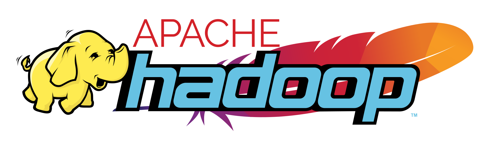

### Hi there 👋

I am Ahmad Ehyaei, a data scientist and explorer.
Over the last 10 years, I have executed numerous data-driven industrial projects. 
I am interested in discovering the world around me through data.

### Languages and Tools:

	
	
	
	
	
	
	
	
	
	
	
	
	
	
	
	
		
	
	

## Generative Art

I like also generative art.

